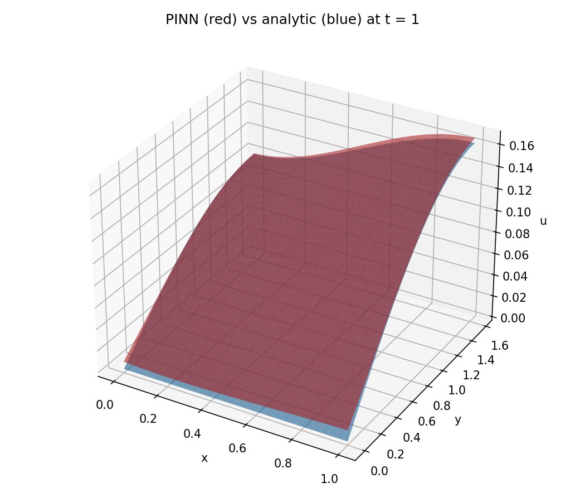
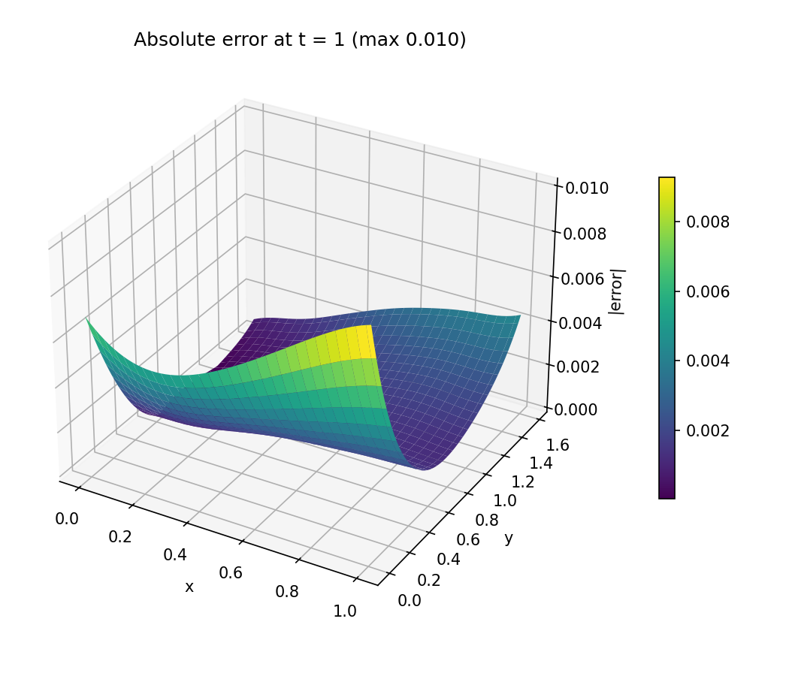
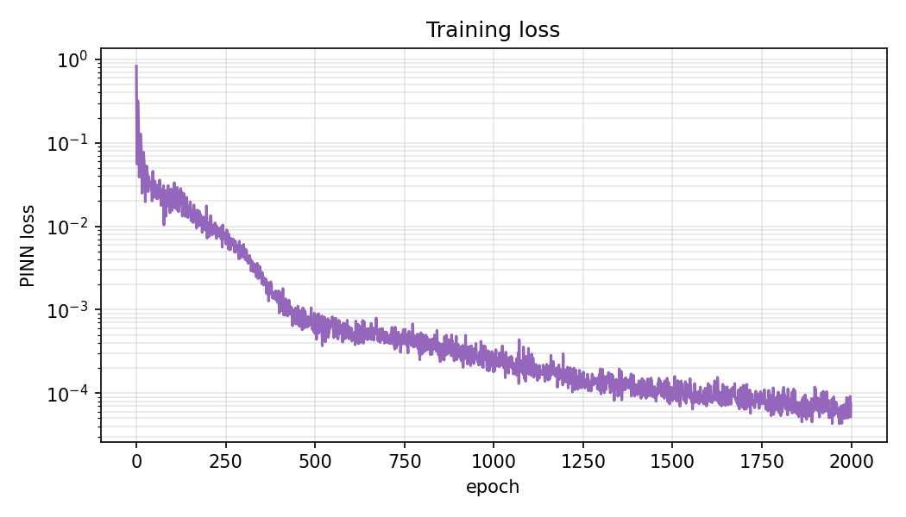

# PINN from scratch

> A minimal automatic-differentiation engine and GPU runtime, built from scratch
> (NumPy + Numba/CUDA) to **understand what lives under PyTorch** — then used to
> solve a 2-D heat equation with a Physics-Informed Neural Network (PINN).

This is an **educational example built on Numba**, not production code: a
reverse-mode autograd `Tensor` (with the higher-order derivatives a PINN needs),
a hand-written GPU memory allocator, and hand-written CUDA kernels (tiled matmul,
reductions, elementwise), assembled into an MLP that learns the solution of a PDE
from its residual alone. For real work, use PyTorch or JAX — the point here is to
see how the pieces work.

## The problem

2-D heat equation with a source term:

$$\frac{\partial u}{\partial t} = \Delta u + xt^2 \sin y,\quad 0<x<1,\ 0<y<\tfrac{\pi}{2},\ t>0$$

$$\frac{\partial u}{\partial x}\Big|_{x=0}=\frac{\partial u}{\partial x}\Big|_{x=1}=0,\qquad u\big|_{y=0}=0,\quad \frac{\partial u}{\partial y}\Big|_{y=\pi/2}=0,\qquad u\big|_{t=0}=0$$

The network $u_\theta(x,y,t)$ is trained to minimize the mean-squared PDE
residual plus the boundary and initial residuals — no labelled data. The result
is validated against a closed-form Fourier-series solution.

## Results

Trained for 2000 epochs on CPU (≈10 s), the PINN matches the analytic solution
to a **maximum absolute error of ≈0.01** at $t=1$.


| PINN vs analytic ($t=1$) | Absolute error | Training loss |
| ------------------------ | -------------- | ------------- |
|  |  |  |


Regenerate with `poetry run python scripts/make_figures.py`.

## How it works

Four layers of abstraction, each built from the one below:

1. **Compute backend** — array primitives (matmul, elementwise, reductions).
  Two interchangeable implementations: pure NumPy (`backend/cpu.py`) and
   hand-written CUDA kernels (`backend/kernels.py`, `backend/cuda.py`). The
   matmul kernel is a classic shared-memory **tiled GEMM**.
2. **Memory allocator** (`backend/memory.py`) — a pooled best-fit allocator over
  one flat buffer with gap coalescing, so thousands of short-lived tensors don't
   each pay a device-allocation cost.
3. **Autograd** (`core/tensor.py`) — reverse-mode AD where the backward functions
  are themselves `Tensor` operations, so gradients stay differentiable. That is
   what makes the **second derivatives** $u_{xx}, u_{yy}$ possible.
4. **Model & PDE** (`nn/`, `pde/`) — Xavier-init MLP, Adam, and the
  physics-informed loss; plus the analytic reference.

## Quickstart

```bash
poetry install                 # core (CPU) deps
poetry run pytest              # full suite runs on CPU, no GPU required
poetry run python -m pinn.train --epochs 2000
```

Optional extras: `--extras viz` (figures), `--extras reference` (PyTorch
baseline).

Switch backend in code:

```python
from pinn import backend
backend.use("cuda")   # if an NVIDIA GPU is present; defaults to "cpu"
```

## Testing

The correctness evidence is numerical: every differentiation rule is checked
against finite differences (`tests/test_autograd.py`), including second-order
derivatives; the allocator's no-overlap/coalescing invariants are fuzzed; the
analytic solution is verified to satisfy the PDE/BC/IC; and the full PINN is
trained to convergence. CUDA kernels are checked for parity against the NumPy
backend, auto-skipped when no GPU is present.

## Layout

```
src/pinn/backend/   CPU (NumPy) and CUDA (Numba) backends + pooled GPU allocator
src/pinn/core/      reverse-mode autograd Tensor
src/pinn/nn/        Linear, Sigmoid, MLP, Adam
src/pinn/pde/       heat-equation PINN loss + analytic reference
src/pinn/train.py   training loop + evaluation
tests/              gradient checks, allocator, analytic, convergence, CUDA parity
examples/           PyTorch reference implementation
scripts/            figure generation
docs/report/        LaTeX report (RU + EN translation)
```

## License

MIT — see [LICENSE](LICENSE).